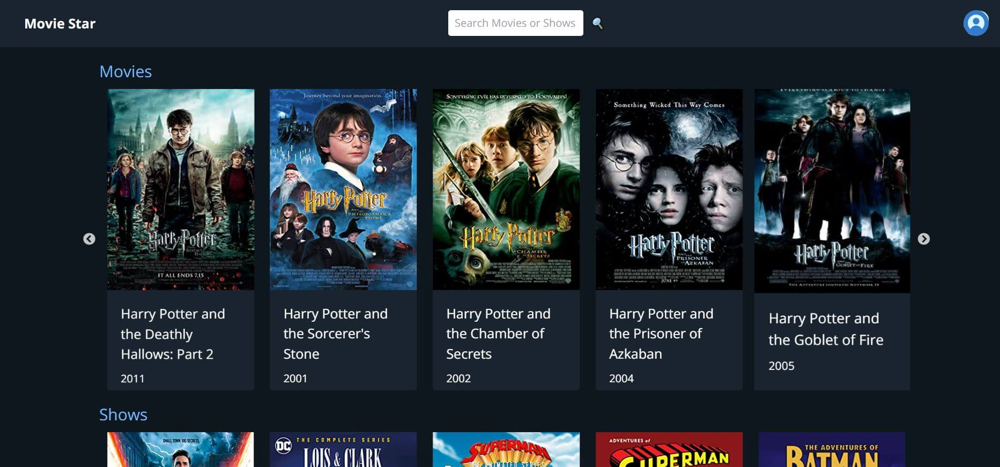

# MOVIE STAR 🔥

MOVIE STAR using OMDB API

## Table of contents

- [Overview](#overview)
  - [Screenshot](#screenshot)
  - [Links](#links)
- [My process](#my-process)
  - [Built with](#built-with)
- [Author](#author)

## Overview

### Screenshot



### Links

- Solution URL: [https://github.com/aros0918/movie-star](https://github.com/aros0918/movie-star)
- Live Site URL: [https://movie-star-tawny.vercel.app/](https://movie-star-tawny.vercel.app/)

1. Clone the repo

   ```sh
   git clone git@github.com:aros0918/movie-star.git
   ```

2. Install NPM packages

   ```sh
   npm install
   ```

3. Run app

   ```sh
   npm start
   ```

## My process

### Built with

- React
- Redux Toolkit
- Tailwind CSS
- Axios
- React Router Dom


